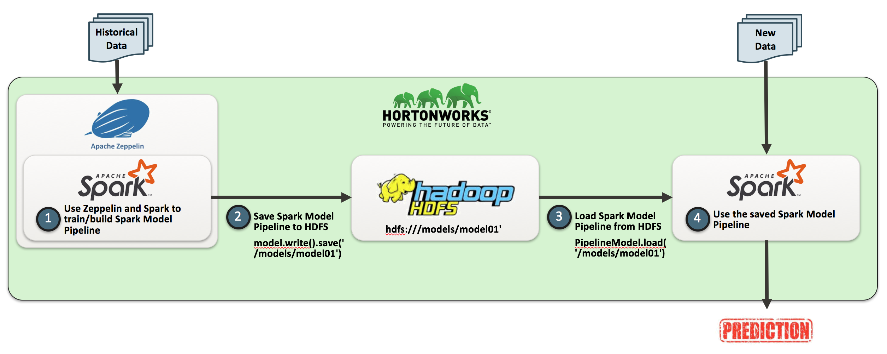
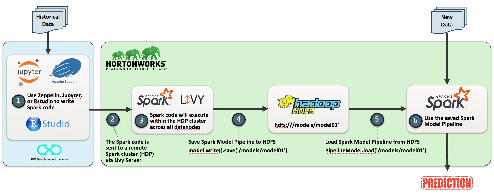
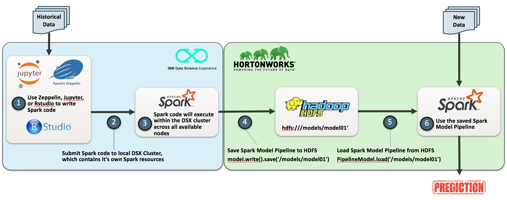
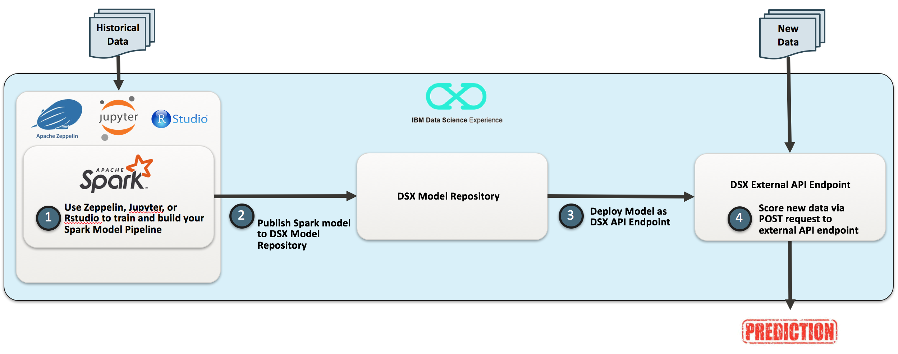
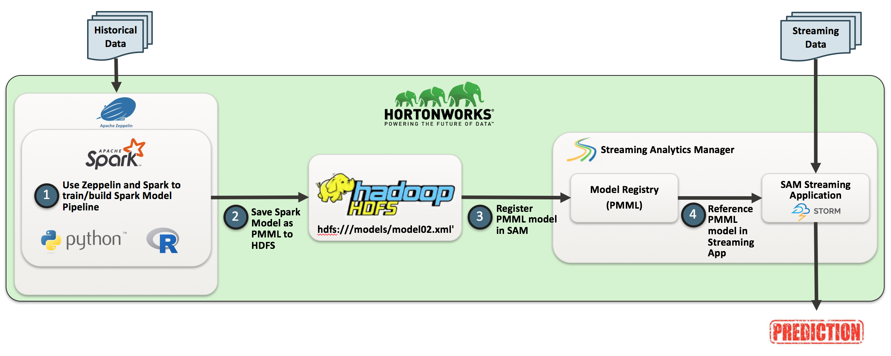

...In Progress...
 
<h3>Model Deployment Strategies</h3>
 As Data Scientists, we spend so much time exploring the data, working on transformations, enriching our core data with external sources, all the work in between to prepare our model pipeline, and then eventually training a machine learning model (whether a regression model, classifier, clustering algorithm, etc.)
 
 At this point, you have a powerful and extremely valuable model...but it's worthless if it is not deployed in production within your organization. 
 
 Just as important, you need deploy your entire model pipeline into production. This takes into consideration all of the data tranformations, enrichments, and predictive models required to take your data from raw to enriched/scored data within you database.
 This repo contains a few of my ideas, strategies, and code for deploying your models in production and at scale.
 
 <h3>So where can machine learning models be deployed?</h3>
 &nbsp;&nbsp;&nbsp;&nbsp;&bull;&nbsp;&nbsp;Deploy as a Batch Process
 &nbsp;&nbsp;&nbsp;&nbsp;&bull;&nbsp;&nbsp;Deploy as a Web Service (REST API)
 &nbsp;&nbsp;&nbsp;&nbsp;&bull;&nbsp;&nbsp;Deploy within Web App
 &nbsp;&nbsp;&nbsp;&nbsp;&bull;&nbsp;&nbsp;Deploy online as part of a real-time data stream
 &nbsp;&nbsp;&nbsp;&nbsp;&bull;&nbsp;&nbsp;Deploy/Embed within Devices
 
 <h3>Based on these deployments, here are high-level flows for several deployment designs (including open source tech being used): </h3>
NOTE: A deeper-dive design ref architecture is in progress for each
 
 <b>ML Deployment Design - Batch</b>
 
 
 <b>ML Deployment Design - Batch</b>
 
 
 <b>ML Deployment Design - Batch</b>
 
 
 <b>ML Deployment Design - API Endpoint</b>
 
 
 <b>ML Deployment Design - Real-time, Streaming Analytics</b>
 
 
 <b>References:</b>
 
